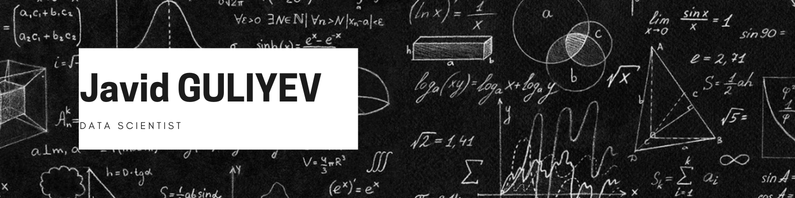

# Welcome to my GitHub! 

### Hi, I'm Javid! 

I am a **Machine Learning Engineer** at **Digital Umbrella**.

My areas of expertise include **Machine Learning**, **Deep Learning**, **Data Visualization**, **Computer Vision**, **Linear and Hierarchical Regression**, **Classification, Clustering**, **Recommendation Systems**, **Decision Trees**, **Neural Networks**, and **Network Analyses**. I am a motivated and hardworking person who always looks for any chance to grip and grasp to expand my knowledge and operational skills and I want to take advantage of all opportunities to reach goals.

I love this field and love to connect with those in it! Please feel free to connect with me on [**LinkedIn**](https://www.linkedin.com/in/cavidqlyv/). 

Thanks and hope to talk soon!

## ⚡Technologies 

      

I start repos that are interesting & potentially useful to me. I even try to organize them into lists now! 
<!--  -->

<!--  -->
<!--  -->

**🤖 Machine Learning**  
Keras, Scikit-Learn, Python, Pandas, Numpy, Seaborn

